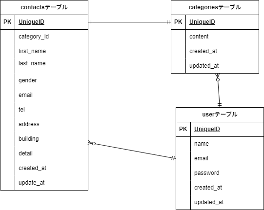

# アプリケーション名
お問い合わせフォーム

## 環境構築
Dockerビルド
1.git clone リンク
2.docker-compose up -d --build

＊MySQLは、OSによって起動しない場合があるので、それぞれのPCに併せてdocker-compose.ymlファイルを編集してください。

Laravel環境構築
1.docker-compose exec php bash
2.composer install
3..example.envファイルから.envを作成し、環境変数を変更
4.php artisan key:generate
5.php artisan migrate --seed
6.php artisan db:seed

## 使用技術(実行環境)
・PHP 8.0
・Larabel 10.0
・MySQL 8.0
　
## ER図

## URL
・開発環境：http://localhost/
・phpMyAdmin： http://localhost:8080/